# 🏥 HealthTech ETL Pipeline

## 📋 Project Description

A local ETL pipeline designed to process doctor and medical appointment data from Excel files and load them into a PostgreSQL database. This solution automates data cleaning, transformation, and loading for digital health analysis.

---

## 📁 Project Structure

```
ETLDataEngineer/
├── 📁 data/
│   └── 📁 raw/                 # Raw input files (Excel)
│       ├── doctors.xlsx
│       └── appointments.xlsx
├── 📁 logs/                    # Execution logs
│   └── etl_pipeline.log
├── 📁 notebooks/               # Jupyter notebooks for EDA
├── 📁 sql/                     # SQL queries organized by business question
│   ├── 1_most_confirmed_doctor.sql
│   ├── 2_patient_34_confirmed.sql
│   ├── 3_cancelled_oct_21_24.sql
│   └── 4_confirmed_per_doctor.sql
├── 📁 src/
│   ├── 📁 ETL/                 # ETL Classes (DoctorsETL, AppointmentsETL, services)
│   ├── db.py                   # DB connection and schema initialization
│   └── run_etl.py              # Main ETL pipeline script
├── 📄 docker-compose.yml       # PostgreSQL Docker configuration
├── 📄 Makefile                 # Project orchestration
├── 📄 requirements.txt         # Python dependencies
├── 📄 .env.example             # Environment variables template
└── 📄 README.md                # This file

```

---

## 🗄️ Database Schema

### Relationship Diagram


---

## 🔄 ETL Pipeline Workflow

### Process Flowchart

```mermaid
flowchart TD
    A["Excel Files (data/raw/)"] --> B["Extract (Pandas read_excel)"]
    B --> C{Transform}
    
    C --> D["Doctors: Name cleaning & Type validation"]
    C --> E["Appointments: Drop missing patient_id & Normalize status"]
    
    D --> F[Valid Doctor IDs]
    E --> G{Referential Integrity Filter}
    F --> G
    
    G --> H["Valid Appointments (doctor_id exists)"]
    G --> I["Discarded Records (Logged for audit)"]
    
    H --> J[Load PostgreSQL]
    D --> J
    
    J --> K["Healthtech Schema (TRUNCATE + INSERT)"]
    K --> L["✅ Data ready for queries"]

```



## 📈 Data Quality Metrics

The pipeline generates a quality report at the end of each execution, visible in the logs. The following metrics are calculated to ensure insight reliability:

| Metric | Description | Alert Threshold |
| --- | --- | --- |
| **ID Completeness** | % of records with non-null `patient_id` and `doctor_id`. | < 100% (Critical Error) |
| **Referential Integrity** | % of appointments whose `doctor_id` exists in the master table. | < 95% (Warning) |
| **Duplicate Rate** | Number of rows removed due to being identical. | > 5% (Check source) |
| **Typing Success** | % of dates (`booking_date`) successfully converted to DateTime. | < 100% (Format Error) |

---

## 🛠️ Error Handling and Exceptions

The system is designed to be **fail-safe**, documenting every anomaly without compromising the entire process:

### 1. Critical Errors (Pipeline Stops)

* **Connection Failure:** If the PostgreSQL container is inactive, the script stops and raises a `ConnectionError`.
* **Corrupted Files:** If Excel files cannot be read by Pandas, the process terminates to prevent partial data loading.
* **Invalid Schema:** If mandatory columns (`id`, `status`) are missing, the pipeline aborts.

### 2. Non-Critical Errors (Filter & Log)

To maintain business continuity, certain errors only discard the affected row:

* **Orphaned `Doctor ID`:** If an appointment belongs to a doctor not found in `doctors.xlsx`, the appointment is moved to an audit log and is not loaded into the DB to maintain referential integrity.
* **Invalid Date Format:** If a date cannot be parsed, the record is discarded, and the row ID is reported in the log.
* **Unknown Status:** Unmapped statuses are normalized to `unknown` rather than failing, allowing for later analysis of anomalous data.

---

## 📋 Prerequisites

Before running the project, make sure you have the following installed:

* **Python 3.8+**: [Download here](https://www.python.org/downloads/)
* **Docker & Docker Compose**: Required to run the PostgreSQL database locally. [Download Docker Desktop](https://www.docker.com/products/docker-desktop)
* **Make**: Utility for automating commands (preinstalled on Linux/Mac; on Windows, use WSL or Git Bash).

### Virtual Environment Setup (venv)

It is **mandatory** to create a virtual environment to isolate project dependencies and avoid conflicts with the global Python installation.


## 🚀 Quick Start

### 1. Environment Setup

```bash
# Clone the repository
git clone https://github.com/jeanpaulrestedur1234/ETLDataEngineer.git

cd ETLDataEngineer

# Setup environment variables
cp .env.example .env

# Setup Virtual Environment
python3 -m venv venv
source venv/bin/activate  # venv\Scripts\activate on Windows

# Install dependencies and start DB
make install
make up

```


## 📂 Input Data

Place the input files inside the following directory:

```text
data/raw/doctors.xlsx
data/raw/appointments.xlsx
```

All raw data files must be located in:

```text
data/raw/
```


---


### 2. Execution

```bash
# Run the complete pipeline
make run


```

---

## ⚡ Available Commands (Makefile)

| Command | Description |
| --- | --- |
| `make install` | Installs Python dependencies |
| `make up` | Starts the PostgreSQL container |
| `make down` | Stops the PostgreSQL container |
| `make etl` | Runs only the ETL process |
| `make queries` | Executes SQL business queries |
| `make run` | Runs Full Workflow (ETL + Queries) |

---

## ☁️ AWS Architecture (Production Proposal)

### Architecture Diagram


### Stack Justification

* **S3 + Lambda:** Event-driven ingestion.
* **AWS Glue:** Scalable serverless Spark/Python environment.
* **RDS:** Fully managed relational database.
* **CloudWatch:** Centralized observability for logs and failures.


---


## 📊 Business Queries

Once the ETL is finished, the following are automatically executed:

1. **🏆 Ranking:** Doctor with the highest number of confirmed appointments.
2. **👤 Specific Patient:** Confirmed history for patient #34.
3. **❌ Loss Analysis:** Cancelled appointments during the 2021-2024 period.
4. **📈 KPI:** Confirmation ratio by medical specialty.

---

## ✨ Key Features

✅ **Idempotency:**  can run the pipeline multiple times; the final result will always be consistent.

✅ **Audit Logging:** Every discarded record has a "reason" documented in the log file.

✅ **Cloud-Ready Architecture:** Designed for easy migration to AWS Glue and RDS.

## 🏗️ AWS Glue Deployment

### 1. Build the Package
Pack the code into an `.egg` file for Glue:
```bash
make build-glue
```

### 2. Upload to S3
Upload the following files to your bucket:
- `src/dist/*.egg` -> `s3://bucket/lib/`
- `glue_job/glue_etl.py` -> `s3://bucket/scripts/`
- `data/raw/*.xlsx` -> `s3://bucket/data/`

### 3. Run Glue Job
Use the `Python Shell` with minimal configuration. Pass `DOCTORS_INPUT`, `APPOINTMENTS_INPUT`, and DB credentials as Job Arguments.

### 4. Local Testing
You can test the Glue logic locally (mocked):
```bash
./venv/bin/python tests/test_glue_local.py
```
